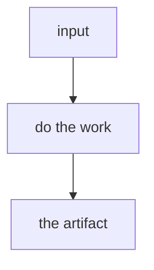

## Overview

The usual way flattens the problem. `/SKILL_NAME` keeps the part that matters.

One or two short paragraphs: what it does, the cap or stopping rule, what it will not do.

| The usual way | `/SKILL_NAME` |
| --- | --- |
| … | … |
| … | … |
| … | … |

### A pass



## Prerequisites

[Grok Bot](https://docs.x.ai/grok-bot/skills-routines-and-automations). Name anything else the run actually needs (Notion, a builder bot, OWNER at phase exits).

## Install

```bash
gh repo clone rickgorman/agent-files
cp -R agent-files/grok-bot/SKILL_NAME /home/box/agent-data/workflows/SKILL_NAME
```

`/home/box/agent-data/workflows/` is the shared skill arsenal on the Grok Bot box. Enable the skill for the bot that will run it, then invoke `/SKILL_NAME` from the composer.

```
/SKILL_NAME path/to/target
/SKILL_NAME                    # missing input: it asks
```

## When to use

When the situation is X. Not Y.

## Output

- The artifact or sections the run produces
- What it will not do

The procedure the agent follows is in [SKILL.md](SKILL.md).
