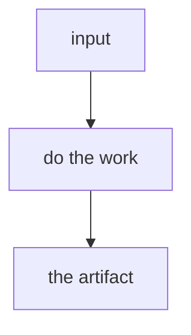

## Overview

The usual way flattens the problem. `/SKILL_NAME` keeps the part that matters.

One or two short paragraphs: what it does, the cap or stopping rule, what it will not do.

| The usual way | `/SKILL_NAME` |
| --- | --- |
| … | … |
| … | … |
| … | … |

### A pass



## Prerequisites

[Claude Code](https://docs.anthropic.com/en/docs/claude-code). That's it. Name anything else the run actually needs.

## Install

```bash
gh repo clone rickgorman/agent-files
cp -R agent-files/skills/SKILL_NAME ~/.claude/skills/SKILL_NAME
# or into a project:  cp -R agent-files/skills/SKILL_NAME .claude/skills/SKILL_NAME
```

```
/SKILL_NAME path/to/target
/SKILL_NAME                    # missing input: it asks
```

## When to use

When the situation is X. Not Y.

## Output

- The artifact or sections the run produces
- What it will not do

The procedure the agent follows is in [SKILL.md](SKILL.md).
