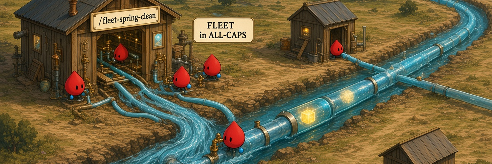

# grok-bot

Fleet playbooks I actually run on Grok Bot.

## The Prompts

### [`/fleet-spring-clean`](fleet-spring-clean/)

> *Declutter a multi-bot fleet: two Notion brains, one boss per seat, boards, briefs, arsenal.*

The sidebar filled up. Notion grew a third "misc" root. Skills got pasted into blurbs. This is a phased clean — inventory first, then brains, names, boards, briefs, logs, CreateAgent rules, and a shared arsenal. It pauses for an explicit yes before every step by default. It does not delete bots. Your URLs stay in a filled config copy, not in this folder.

## Table of Contents

- [Quick Start](#quick-start)
- [Design Philosophy](#design-philosophy)
- [License](#license)

## Quick Start

Copy a package onto the Grok Bot box:

```bash
gh repo clone rickgorman/agent-files
cp -R agent-files/grok-bot/<name> /home/box/agent-data/workflows/<name>
```

Enable it for the bot that will run it, then invoke `/<name>` from the composer. That path is `/home/box/agent-data/workflows/`, not `~/.claude/skills/`.

To add a package: [.claude/grok-bot-folder.md](../.claude/grok-bot-folder.md), skeleton [.claude/data/grok-bot-package-template/](../.claude/data/grok-bot-package-template/), `/add-new-grok-bot-skill`, heroes via `/generate-grok-bot-hero-prompt` then GenerateImage in Grok Bot. When the package list changes, regenerate this page's `grok-bot-hero.png` (`--kind section`).

## Design Philosophy

Pretty simple — same bar as the root repo, plus the Grok Bot visual lock.

### 1. Share tools I use all the time

If I don't run it on a real fleet, it doesn't ship here.

### 2. Scale with how smart the models get

Playbooks that get better as the bots get sharper — structure over pasted blurbs.

### 3. Single-purpose and composable

Each package does one job. Stack them; don't merge them into a kitchen sink.

## License

MIT. See the repo [LICENSE](../LICENSE).
