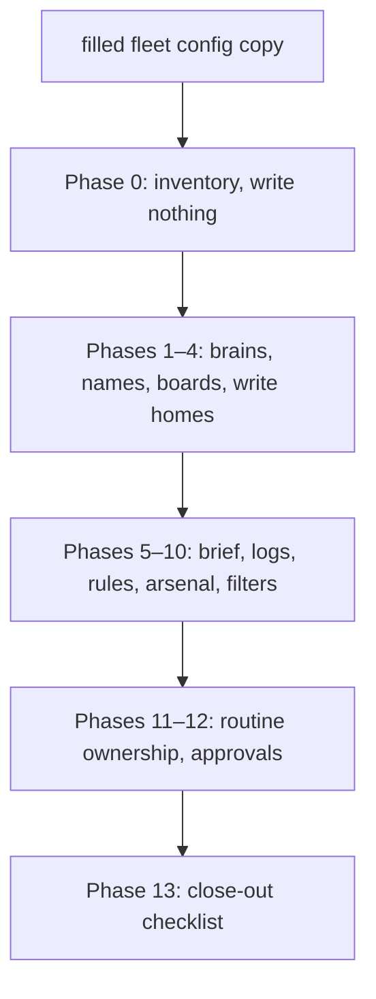

# /fleet-spring-clean

## Overview

The sidebar filled up. Notion grew a third "misc" root. Skills got pasted into blurbs. `/fleet-spring-clean` is a phased clean of a multi-bot Grok Bot fleet: inventory first, then brains, names, boards, briefs, logs, CreateAgent rules, and a shared arsenal.

It does not delete bots. It does not know your company. Owner names and private URLs live in a filled *copy* of the blank fleet config, never in this folder.

| Ad-hoc cleanup | `/fleet-spring-clean` |
| --- | --- |
| Sidebar delete and hope | Inventory, then reorg, then encode |
| A third Notion root "for misc" | Two brains + a child archive |
| Paste `SKILL.md` into blurbs | Shared arsenal, attach by path |
| Pause the old cron "just in case" | Delete the leftover; one owner per job |

### A pass



## Prerequisites

[Grok Bot](https://docs.x.ai/grok-bot/skills-routines-and-automations) with Notion connected. A builder bot (`BUILDER_BOT`) that can create and revise bots. OWNER available at each phase Exit.

Duplicate [references/fleet-config-template.md](references/fleet-config-template.md) (or a matching Notion page) and fill the copy before Phase 1. Leave the blank template blank.

## Install

```bash
gh repo clone rickgorman/agent-files
cp -R agent-files/grok-bot/fleet-spring-clean /home/box/agent-data/workflows/fleet-spring-clean
```

`/home/box/agent-data/workflows/` is the shared skill arsenal on the Grok Bot box. Enable the skill for `BUILDER_BOT`, then invoke it from the composer:

```
/fleet-spring-clean
/fleet-spring-clean path/to/fleet-config.md
```

No config? It asks. It will not invent a roster, and it will not write into the blank template.

## When to use

When the fleet is noisy: unclear bosses, stray Notion roots, skills and routines with no log or brief. When you want a recipe someone else can run on *their* fleet. Not for one domain's sales strategy, and not for deleting agents.

## Output

- A read-only inventory OWNER agrees is enough to reorg
- Two Notion brains + child archive, one boss path per warm seat
- Project boards on `STAGE_SET`, one write home per role
- Daily brief aggregate, routine-run log, CreateAgent rules, owner-mode, arsenal
- Close-out: no orphaned paused crons, leftovers handed to OWNER

It will not destroy bots, fan out daily reflect, auto-vendor skills, or put your URLs in the playbook. The procedure the agent follows is in [SKILL.md](SKILL.md).
