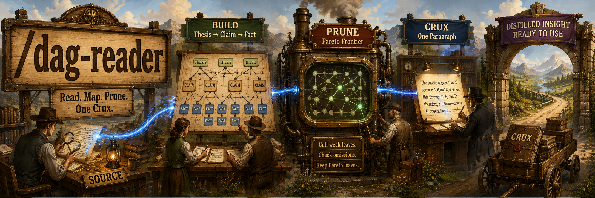
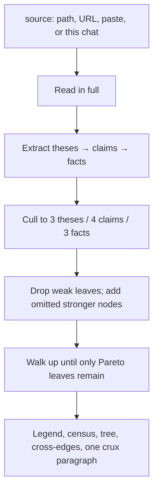

## Overview

A summary flattens an argument. `/dag-reader` keeps the spine: theses, the claims that hold them up, and the facts those claims rest on. It reads a source in full, builds that DAG, prunes to the Pareto leaves, and ends with one paragraph that is the crux.

It culls to 3 theses, 4 claims each, 3 facts each, then walks the tree from the leaves up. A remaining leaf has to do inferential work no sibling also does. If a sibling is easier and at least as strong, the weaker one goes. Extra node types (caveat, mechanism, warrant) are allowed only as a small fraction of the DAG.

| A summary | `/dag-reader` |
| --- | --- |
| Restates the piece | Shows what depends on what |
| Keeps the colorful bits | Keeps the load-bearing bits |
| Ends with "in summary" | Ends with one crux paragraph |

### A pass



## Prerequisites

[Claude Code](https://docs.anthropic.com/en/docs/claude-code). That's it. You also need a source: a file, a URL, pasted text, or something already in the conversation.

## Install

```bash
gh repo clone rickgorman/agent-files
cp -R agent-files/skills/dag-reader ~/.claude/skills/dag-reader
# or into a project:  cp -R agent-files/skills/dag-reader .claude/skills/dag-reader
```

```
/dag-reader path/to/article.md
/dag-reader https://example.com/the-piece
/dag-reader                    # use the source already in this conversation
```

You can also paste the text as the argument. No path, no URL, nothing in the chat? It asks.

## When to use

A paper, report, transcript, post, or plan you have to understand before you act on it, or argue with it. Argumentative or evidence-bearing text. Not a changelog or a recipe.

## Output

- Legend: tag, kind, role for every node type used
- Census: counts by type, and how much of the DAG is extra types
- Tree: ASCII tree of the surviving nodes
- Cross-edges: the links that make it a DAG rather than only a tree
- Crux: exactly one paragraph, packed from the frontier

It will not write a file unless asked, invent a thesis the source does not argue, put pruned interior back into the crux, or add a second paragraph. The procedure the agent follows is in [SKILL.md](SKILL.md).
