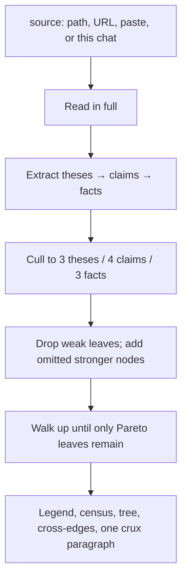

# dag-reader

Steal when you need the spine of an argument, not a summary.

`/dag-reader` reads a source into a **thesis → claim → fact** DAG, prunes to the Pareto leaves, and ends with **one paragraph** that is the crux. Summaries flatten. A DAG keeps what holds what up.

| A summary | `/dag-reader` |
| --- | --- |
| Restates the piece | Shows what depends on what |
| Keeps the colorful bits | Keeps the load-bearing bits |
| Ends with "in summary" | Ends with one crux paragraph |

## A pass



A remaining leaf must do inferential work no sibling also does. If a sibling is easier-or-equal **and** stronger-or-equal, the weaker one goes.

## When

A paper, report, transcript, post, or plan you have to understand before you act on it — or argue with it. Any argumentative or evidence-bearing text.

Don't steal this to summarize a changelog or a recipe.

## Steal

```bash
gh repo clone rickgorman/agent-files
cp -R agent-files/skills/dag-reader ~/.claude/skills/dag-reader
# or into a project:  cp -R agent-files/skills/dag-reader .claude/skills/dag-reader
```

Needs [Claude Code](https://docs.anthropic.com/en/docs/claude-code).

```
/dag-reader path/to/article.md
/dag-reader https://example.com/the-piece
/dag-reader                    # use the source already in this conversation
```

You can also paste the text as the argument. No path, no URL, nothing in the chat? It asks.

## What you get

- **Legend** — tag, kind, role for every node type used
- **Census** — counts by type, and how much of the DAG is extra types
- **Tree** — ASCII tree of the surviving nodes
- **Cross-edges** — the links that make it a DAG rather than only a tree
- **Crux** — exactly one paragraph, packed from the frontier

It keeps at most 3 theses, 4 claims each, 3 facts each, then prunes from there. Extra node types (caveat, mechanism, warrant, implication, …) are allowed only as a small fraction of the DAG.

## What it will not do

- Write a file unless asked.
- Invent a thesis the source does not argue.
- Reintroduce pruned interior into the crux.
- Add a second paragraph, a bullet restatement, or a preamble ("In summary").

The procedure the agent follows is in [SKILL.md](SKILL.md).
