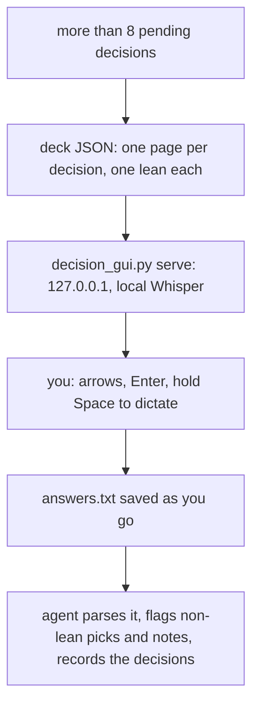

## Overview

Long sessions pile up decisions. The agent dumps twenty of them into one chat message, you answer six, and the other fourteen quietly become the agent's call. `/decision-gui` turns the pile into a deck: one page per decision, the agent's honest lean marked, and your answers handed back in a format it parses.

Each page frames the problem in a paragraph or two, then offers 2–4 choices with their gains and costs. Every choice carries at least one cost, the lean included. You move with the arrow keys, press Enter to take the lean, and hold Space to dictate a note. The voice runs on local Whisper and streams into the note as you speak. Answers save as you go, so the agent reads them from disk when you say you're done.

| The usual way | `/decision-gui` |
| --- | --- |
| Twenty decisions in one wall of chat | One decision per page, ordered by dependency |
| "Option B looks fine I guess" | Gains and costs for every choice, and the agent's lean marked |
| Half the list answered, the rest assumed | A progress bar and an answer sheet; open items are listed, not guessed |
| Typing a paragraph to explain one exception | Hold Space and say it; local Whisper streams it into the note |
| Copy-pasting answers back | Answers save to disk as you click; the agent reads the file |

### A pass



## Prerequisites

[Claude Code](https://docs.anthropic.com/en/docs/claude-code). Also:

- Python 3.11+.
- [`uv`](https://docs.astral.sh/uv/) for the local server. It installs the server's packages on first run.
- **Local voice** needs Apple Silicon (`mlx-whisper`, large-v3-turbo; the model downloads on first use). Elsewhere, voice falls back to OpenRouter if `OPENROUTER_API_KEY` is set, using only endpoints that do not train on or retain your audio. Without either, the deck works without voice.
- The self-contained page mode (`--artifact`) needs only the Python standard library.

## Install

```bash
gh repo clone rickgorman/agent-files
cp -R agent-files/skills/decision-gui ~/.claude/skills/decision-gui
# or into a project:  cp -R agent-files/skills/decision-gui .claude/skills/decision-gui
```

```
/decision-gui                         # build a deck from the decisions pending in this session
/decision-gui plan.deck.json          # reopen a deck you have not finished
/decision-gui --artifact              # one self-contained HTML page, no voice
```

The agent also reaches for it on its own when more than 8 decisions are waiting on you.

## When to use

When a planning or design session has left you with a batch of real choices, and you want to make them yourself rather than let the agent default them. Architecture reviews, roadmap lock-ins and tool selection all fit.

Not for one or two quick questions; the agent asks those in chat. Not for choices the agent should just make.

## Output

- A one-screen deck in the browser: light and dark themes that follow your system setting, a progress bar, and a two-column answer sheet
- `<deck>.answers.txt`, saved as you work, in a fixed format the agent parses
- Back in the session: a table of your choices, every non-lean pick and note called out, and the decisions written to the project's decision log if it has one

It will not invent decisions to fill a deck, and it will not put private data in a page meant for sharing.

The procedure the agent follows is in [SKILL.md](SKILL.md).
