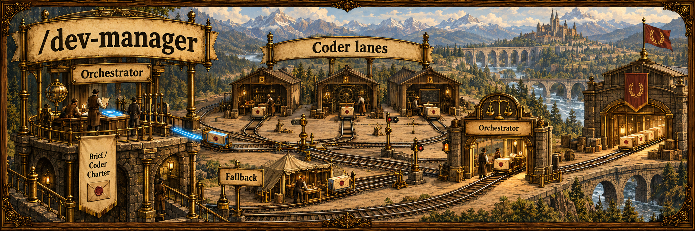
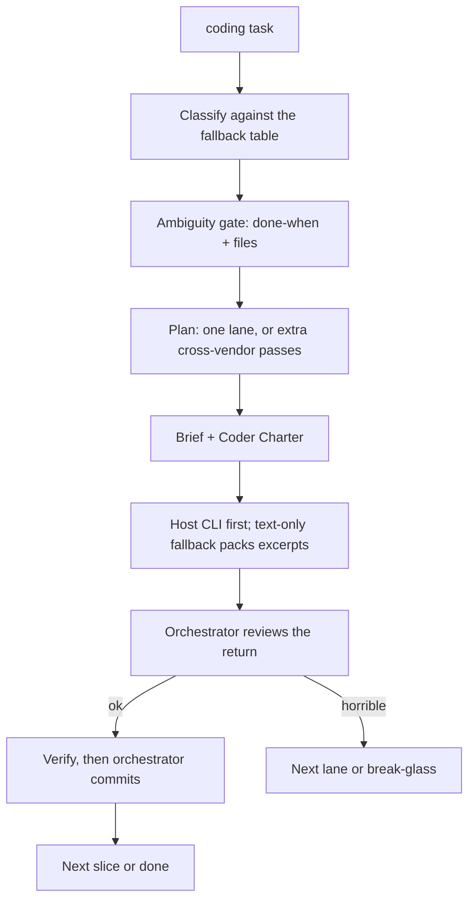

## Overview

The session model that writes the code also judges the code. `/dev-manager` splits that: you stay the orchestrator — decompose, brief, review, verify, commit — and every implementation line lands on a coder lane. Lanes are picked from a locked task→model fallback table, not vibes.

You pin an orchestrator with `--model` only when you mean to. Default is whoever is already running the session. Empty invocation arms the doctrine for the coding task in front of you. Read it before anyone types.

| Session model writes the tree | `/dev-manager` |
| --- | --- |
| One model judges and emits | Orchestrator judges; coder lanes emit |
| Hottest seat takes every slice | Fixed fallback sequence; bias off the hot lane |
| Fuzzy "go implement it" | Brief + Coder Charter, or you don't dispatch |

### A cycle



Roster exemplars: Opus, Composer, Grok, and Astra (`gpt-6-astra`, xhigh) as the Codex gate lane. Decompose alternates orchestrator ⇄ Astra. Small and everyday emission stays Composer / Grok / Opus. Missing binaries drop down the row. A text-only fallback, if one exists on the machine, gets file excerpts in the brief because it cannot see the repo.

## Prerequisites

| | Binary | Seat |
| --- | --- | --- |
| Required | [Claude Code](https://docs.anthropic.com/en/docs/claude-code) | the orchestrator session |
| Optional | [`claude`](https://github.com/anthropics/claude-code) | `opus` |
| Optional | [`cursor-agent`](https://cursor.com/docs/cli/overview) | `composer` |
| Optional | [`grok`](https://github.com/xai-org/grok-build) | `grok` |
| Optional | [`codex`](https://github.com/openai/codex) | Astra (`gpt-6-astra`, xhigh) |

Optional binaries must be on `PATH` and logged in. A missing family is a fallback, not an abort. The Cursor CLI docs install the binary as `agent`; if `cursor-agent` is missing, `agent` on `PATH` is the same seat.

## Install

```bash
gh repo clone rickgorman/agent-files
cp -R agent-files/skills/dev-manager ~/.claude/skills/dev-manager
# or into a project:  cp -R agent-files/skills/dev-manager .claude/skills/dev-manager
```

```
/dev-manager                         # standing doctrine for the current coding task
/dev-manager --model <name>          # pin the orchestrator
/dev-manager implement the retry queue
```

No task and nothing in the session? It asks.

## When to use

At the start of any task that will create or edit code, before a single line. Not for a read-only look at a paper, and not as a substitute for finishing the plan first.

## Output

- Orchestrator (session or pin), the lane you picked, and why you skipped a hotter or missing seat
- The brief that went out, the review verdict, the verify commands, next/done/block

It will not have the session model emit product code except a named trivial edit or break-glass, execute an unreviewed delegate plan, or proceed on a destructive path when multi-lane deliberation is below quorum (≥2 external seats returned). The procedure the agent follows is in [SKILL.md](SKILL.md).
