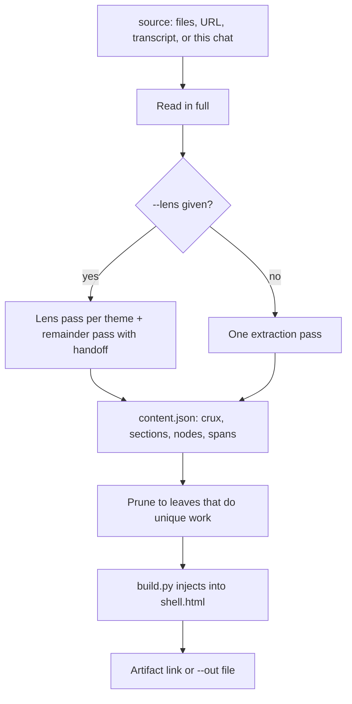

## Overview

A summary gives everyone the same two minutes. `/expandable-reader` gives the reader a world map and lets them spend the rest of their time where they choose.

It reads the whole source, distills it into a typed tree of nuggets (tactic, lesson, mechanism, caveat, moment), and renders one HTML page: a crux paragraph on top with clickable phrases, toggle sections beneath it, and node lines that open in place to show what sits underneath. Three levels deep at most. Leaves are things you can use, never quotes or recaps. Optional lenses (`--lens security`) get their own sections so a cross-cutting theme is not smeared across the rest.

| A summary | `/expandable-reader` |
| --- | --- |
| One depth for everyone | Reader picks depth per phrase |
| Restates the source | Extracts what you can do with it |
| Quotes as evidence | Nuggets with a pointer back to the source's own units |
| A document | A page you can share and click |

### One pass



## Prerequisites

[Claude Code](https://docs.anthropic.com/en/docs/claude-code) and `python3`. The Artifact tool if you want a shareable link; otherwise `--out` writes a standalone file.

## Install

```bash
gh repo clone rickgorman/agent-files
cp -R agent-files/skills/expandable-reader ~/.claude/skills/expandable-reader
# or into a project:  cp -R agent-files/skills/expandable-reader .claude/skills/expandable-reader
```

```
/expandable-reader transcript.txt
/expandable-reader docs/ --lens security --lens cost
/expandable-reader https://example.com/long-post --out post-reader.html
/expandable-reader                       # use the source already in this conversation
```

## When to use

A long transcript, a paper, a design doc, a repo you are onboarding onto, a day of meeting notes. Anything where different readers need different depths and you want one page for all of them. Not a changelog, not a short post.

## Output

- An artifact link (default) or an HTML file (`--out`)
- A census: sections, nodes, zoomable phrases, crux length, lens files
- One line per assumption made while reading (name normalization, garbled passages, inferred attribution)

It will not quote the source as leaves, invent nodes to fill the shape, or write files unless asked. The procedure the agent follows is in [SKILL.md](SKILL.md).
