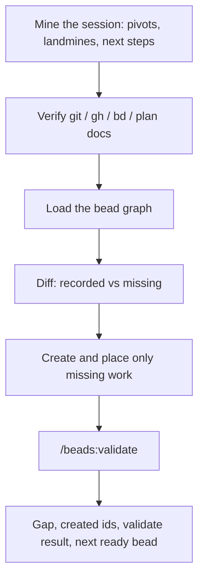

## Overview

A markdown handoff is a copy of what the next agent should already be able to pull from the graph. `/handoff-beads` mines this session, creates only the work that is not already recorded, hangs those beads in the right places, and validates the graph before you leave. The next agent starts at `bd ready`.

It will not write a handoff file. A thin session yields a thin gap report, not a chain of tasks in conversation order.

| A markdown handoff | `/handoff-beads` |
| --- | --- |
| Brief for the next agent | Missing work lands in the bead graph |
| Next agent re-reads a doc | Next agent runs `bd ready` |
| Graph can rot while you write | `/beads:validate` before you leave |

### A pass



## Prerequisites

| | What |
| --- | --- |
| Required | [Claude Code](https://docs.anthropic.com/en/docs/claude-code) |
| Required | [`bd`](https://github.com/steveyegge/beads) on `PATH`, and a `.beads/` database in the project |
| Required for the full gate | `/beads:validate` (beads planner pack). Without it, the run falls back to `bd dep cycles` and `bin/bead-verify` when present |

No beads database? It stops. It will not `bd init`.

## Install

```bash
gh repo clone rickgorman/agent-files
cp -R agent-files/skills/handoff-beads ~/.claude/skills/handoff-beads
# or into a project:  cp -R agent-files/skills/handoff-beads .claude/skills/handoff-beads
```

```
/handoff-beads                 # session's primary project
/handoff-beads <project>       # when the session touched several threads
```

No project in the session, and several unrelated ones in play? It asks.

## When to use

End of a session on a project that already has a bead graph, when the next agent should pick up from the graph rather than from a markdown brief. Not a substitute for `/beads:compile` on a parked plan, and not a way to start a graph from scratch.

## Output

- Gap: what was unrecorded, skipped as already recorded, or left as not-work
- Created: new bead ids, parents, deps, and why they hang there
- Validate: `/beads:validate` (or the degraded gate) and the result
- Next: the first `bd ready` bead

It will not write a handoff doc, invent beads, dump a conversation-order chain, or commit. The procedure the agent follows is in [SKILL.md](SKILL.md).
