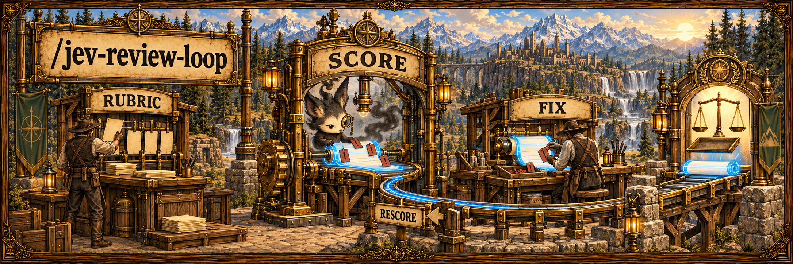
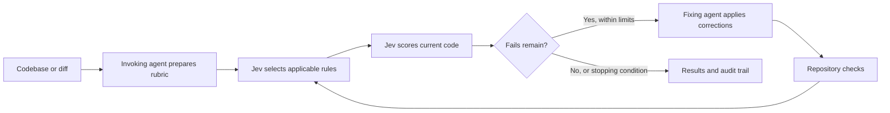

## Overview

Your invoking agent builds a rubric from the codebase and review goal. Jev
selects the rules that apply, then scores the current code. A fixing agent
handles the failures, and Jev scores the result again. Supply your own rubrics
when you have them; no rubric file is required.

The loop stops when no fails remain, progress stalls, five fixing rounds finish,
or Jev spend reaches $5. Failed evaluations produce an incomplete report.

| A one-pass review | `/jev-review-loop` |
| --- | --- |
| Implicit review criteria | An explicit, saved rubric derived from your project |
| Findings without rechecking | Current code is scored again after fixes |
| Unclear stopping point | Progress, round, and spend limits with an audit trail |



## Prerequisites

- An agent harness that can read skills and run local commands, such as Claude Code.
- Node.js and compatible `ai` / `@ai-sdk/gateway` packages exposing the
  experimental evaluation API.
- A Vercel AI Gateway key with access to `typesafe-ai/jev`, normally exported as
  `AI_GATEWAY_API_KEY`.
- For fixes or calibration: Codex CLI with access to the default Sol model, or
  an available fixing/calibration agent supplied by the caller.
- For GitHub PRs: authenticated `gh`. Local codebase reviews do not need it.

No `.env` file is needed with the default key name. For a differently named
secret variable, set `JEV_API_KEY_ENV` to that variable's name in the environment
or in an optional `.env` beside `SKILL.md`. The override contains the **name**,
not the secret. Keep it local.

## Install

```bash
gh repo clone rickgorman/agent-files
cp -R agent-files/skills/jev-review-loop ~/.claude/skills/jev-review-loop
# or into a project:  cp -R agent-files/skills/jev-review-loop .claude/skills/jev-review-loop
```

```text
/jev-review-loop /path/to/project
/jev-review-loop https://github.com/owner/repo/pull/123
/jev-review-loop . --rubric docs/review.md --rubric docs/security.md
/jev-review-loop . --review-only
/jev-review-loop . --calibrate
```

Another skill can invoke it with a target, review goal, optional rubrics, and
authorization constraints. The invoking agent prepares the effective rubric.

## When to use

Use it to review a codebase or PR against explicit criteria, check fixes against
the same criteria, or share a scoring loop across specialized review skills.
It supports any language or framework. Existing tests remain part of validation;
Jev's scores do not replace them.

## Output

- The effective rubric and reviewed scope.
- Per-round applicability, scores, violations, changes, and check results.
- Request counts, available costs, coverage gaps, and the stopping reason.
- Audit artifacts and a concise report back to the invoking agent.

The procedure the agent follows is in [SKILL.md](SKILL.md).
