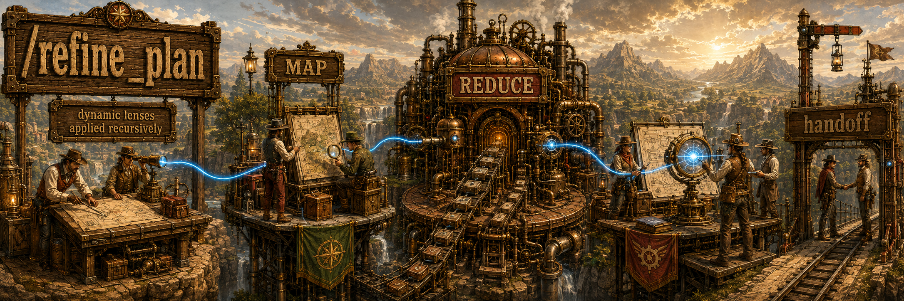
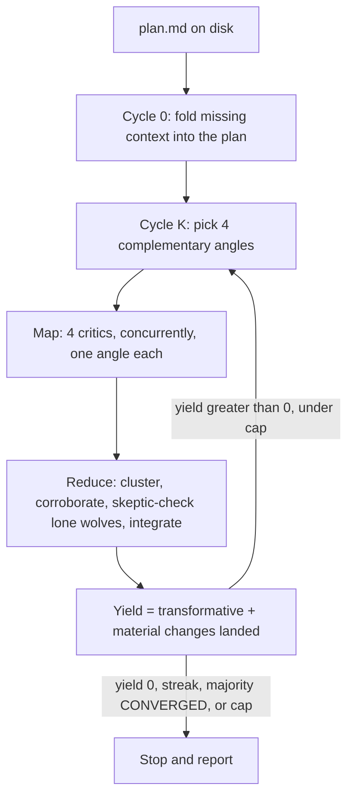

## Overview

A first-draft plan is cheap. Building the wrong one is not. `/refine-plan` runs a four-critic map-reduce over a markdown implementation plan and edits the file until the plan settles into place.

Each cycle maps four critics (different model families, different lenses) onto the current file, reduces their findings, and scores yield: how many `transformative` or `material` changes actually landed. Wording nits don't count. It stops when yield is zero, when a majority of critics say `CONVERGED` two cycles in a row, or at the cap (default 6).

This expands [Jeffrey Emanuel](https://x.com/doodlestein)'s Agent Flywheel Phase 2 (get the plan to steady state before anyone writes code) into a swarm instead of one sequential review. A single model signing off on its own draft is not the same as four families that can't see each other's work, then a reduce the session model owns. If the plan is actually done, a re-run reports yield 0 on cycle 1.

| One more pass from the same model | `/refine-plan` |
| --- | --- |
| Same blind spots | Four vendors, four lenses, rotated |
| Findings die in chat | The plan file is the artifact |
| Open-ended polish | Stops when yield is 0 |

### A cycle



Roster: `opus` (Claude Opus 5), `composer` (Composer 2.5), `grok` (Grok 4.6), `terra` (GPT-5.6 Terra). Discovery checks `PATH` and caches the roster for a day. If a family is missing, that seat falls back to a local Claude agent and the run continues. Seats are shuffled onto angles each wave. The session model does the reduce and keeps a ledger so rejected ideas don't come back next cycle, and so a timed-out angle goes first in the next one. Critics only critique.

## Prerequisites

| | Binary | Seat |
| --- | --- | --- |
| Required | [Claude Code](https://docs.anthropic.com/en/docs/claude-code) | the orchestrator; also the local-fallback critics |
| Optional | `claude` | `opus` |
| Optional | `cursor-agent` | `composer` |
| Optional | `grok` | `grok` |
| Optional | `codex` | `terra` |

Optional binaries must be on `PATH` and logged in. Discovery picks them up automatically. If a family is missing, that seat becomes a local Claude agent. You need the optionals for a real cross-vendor pass.

## Install

```bash
gh repo clone rickgorman/agent-files
cp -R agent-files/skills/refine-plan ~/.claude/skills/refine-plan
# or into a project:  cp -R agent-files/skills/refine-plan .claude/skills/refine-plan
```

```
/refine-plan path/to/plan.md              # edit in place until it converges
/refine-plan path/to/plan.md --dry-run    # critique and report; write nothing
/refine-plan path/to/plan.md --max 3      # cycle cap (default 6)
```

No path? It looks for `PLAN.md`, `docs/plans/*.md`, or a recently edited `*plan*.md`. If it still can't tell, it asks.

## When to use

After a first draft or a planning-team merge. Before beads, a swarm, or anyone writing code. You need a plan already. It won't invent one, and it won't touch code or open a PR.

## Output

- The plan, hardened: architecture, sequencing, failure modes, scope, the holes one seat does not see
- A changelog per cycle: wholeheartedly agree / somewhat agree / disagree
- A report: cycles, yields (`4, 2, 1, 0`), who covered which lens, why it stopped

It will not replace your intent with a different project, inflate yield to keep cycling, or edit anything except the plan file. The procedure the agent follows is in [SKILL.md](SKILL.md).
