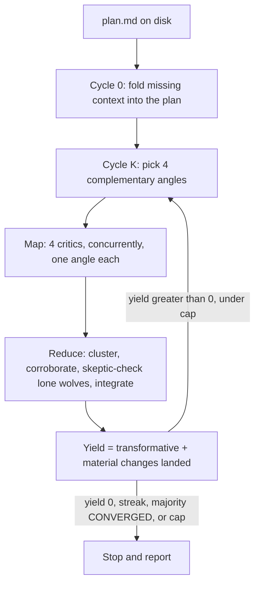

## Overview

Agents are cheap at emitting a plan and expensive at implementing the wrong one. `/refine_plan` is the gate between those two: a concurrent four-critic **map-reduce** that edits a markdown implementation plan **in place** until another round would not change anything that matters.

Each cycle **maps** four independent critics — different model families, different lenses — onto the current file, **reduces** their findings (cluster, corroborate, skeptic-check lone wolves, integrate), and scores **yield**: how many `transformative` or `material` changes actually landed. Incremental and cosmetic noise does not count. The loop stops when yield hits zero, a majority of critics return `CONVERGED` twice, or the cycle cap (default 6).

This is an expansion of [Jeffrey Emanuel](https://x.com/doodlestein)'s Agent Flywheel **Phase 2** — iterate the plan to steady state before anyone writes code — run as a swarm instead of a single sequential review. One model blessing its own draft is not convergence. Four families that cannot see each other's work, then a reduce the session model owns, is. A plan that is actually done survives a re-run with yield 0 on cycle 1. That is the test, not a failure.

| One more pass from the same model | `/refine_plan` |
| --- | --- |
| Same blind spots | Four vendors, four lenses, rotated |
| Findings die in chat | The plan file is the artifact |
| Open-ended polish | Stops when yield is 0 |

### A cycle



Roster: `opus` (Claude Opus 5), `composer` (Composer 2.5), `grok` (Grok 4.6), `terra` (GPT-5.6 Terra). Discovery enumerates whatever is on `PATH` and caches the roster for a day. Missing families become local Claude agents; the run does not abort. Seat→angle pairing is a fresh even permutation each wave. The session model owns the reduce and the carry-forward ledger (rejected proposals are not relitigated; timed-out angles are owed first next cycle). Critics only critique.

## Prerequisites

| | Binary | Seat |
| --- | --- | --- |
| Required | [Claude Code](https://docs.anthropic.com/en/docs/claude-code) | the orchestrator; also the local-fallback critics |
| Optional | `claude` | `opus` |
| Optional | `cursor-agent` | `composer` |
| Optional | `grok` | `grok` |
| Optional | `codex` | `terra` |

Optional binaries must be on `PATH` and logged in. Discovery picks them up automatically. A missing family does not abort the run — that seat becomes a local Claude agent. Cross-vendor convergence needs the optionals.

## Install

```bash
gh repo clone rickgorman/agent-files
cp -R agent-files/skills/refine_plan ~/.claude/skills/refine_plan
# or into a project:  cp -R agent-files/skills/refine_plan .claude/skills/refine_plan
```


```
/refine_plan path/to/plan.md              # edit in place until it converges
/refine_plan path/to/plan.md --dry-run    # critique and report; write nothing
/refine_plan path/to/plan.md --max 3      # cycle cap (default 6)
```

No path? It looks for `PLAN.md`, `docs/plans/*.md`, or a recently edited `*plan*.md`. If it still can't tell, it asks.

## When to use

After a first draft or a planning-team merge. Before beads, a swarm, or anyone writing code. Bring a plan. This does not invent one, does not touch source, and does not open a PR.

## Output

- The plan, hardened — architecture, sequencing, failure modes, scope, the holes one seat does not see
- A changelog per cycle: wholeheartedly agree / somewhat agree / disagree
- A report: cycles, yields (`4, 2, 1, 0`), who covered which lens, why it stopped

It will not replace your intent with a different project, inflate yield to keep cycling, or edit anything except the plan file. The procedure the agent follows is in [SKILL.md](SKILL.md).
