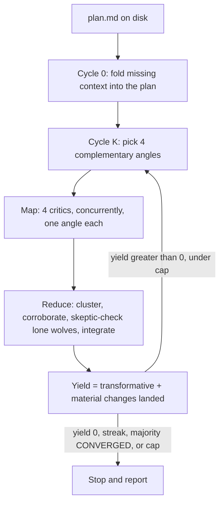

# refine_plan


Steal when a plan is about to become code and you've only reviewed it from one seat.

`/refine_plan` runs [Jeffrey Emanuel](https://x.com/doodlestein)'s Agent Flywheel **"Phase 2: Refine the Plan"** as a concurrent 4-critic map-reduce. It does not ask one model to bless its own draft. Each cycle **maps** four fresh critics onto four complementary angles, **reduces** what they found into the plan file, and repeats until the yield is zero.

**Spend cheap planning tokens now to save expensive implementation tokens later.** A converged plan should survive a re-run almost untouched.

| One more pass from the same model | `/refine_plan` |
| --- | --- |
| Same blind spots | Four vendors, four lenses |
| Findings die in chat | The plan file is the artifact |
| Keep going forever | Stops when yield hits 0 |

## A cycle



Critics are four families — `opus` (Claude Opus 5), `composer` (Composer 2.5), `grok` (Grok 4.6), `terra` (GPT-5.6 Terra) — using whichever provider CLIs are on the machine. A discovery pass enumerates available models and caches the roster for a day. Missing families become local Claude agents. The session model owns the reduce; the critics only critique.

A change is `transformative`, `material`, `incremental`, or `cosmetic`. Only the first two count as **yield**.

## When

You have a markdown plan. You are about to turn it into beads or code. You have only looked at it from one model's point of view.

Don't steal this to invent a plan. Steal it to harden one.

## Steal

```bash
gh repo clone rickgorman/agent-files
cp -R agent-files/skills/refine_plan ~/.claude/skills/refine_plan
# or into a project:  cp -R agent-files/skills/refine_plan .claude/skills/refine_plan
```

Needs [Claude Code](https://docs.anthropic.com/en/docs/claude-code). Optional on PATH: `claude`, `cursor-agent`, `grok`, `codex`. Missing providers do not abort the run — those seats fall back to local Claude agents.

```
/refine_plan path/to/plan.md              # edit in place until it converges
/refine_plan path/to/plan.md --dry-run    # critique and report; write nothing
/refine_plan path/to/plan.md --max 3      # cycle cap (default 6)
```

No path? It looks for `PLAN.md`, `docs/plans/*.md`, or a recently edited `*plan*.md`. If it still can't tell, it asks.

## What you get

- The plan, hardened — architecture, sequencing, failure modes, scope, the holes one seat doesn't see
- A changelog per cycle: wholeheartedly agree / somewhat agree / disagree. Rejected ideas stay rejected next cycle.
- A final report: cycles run, yields (`4, 2, 1, 0`), who covered which lens, why it stopped

It stops at yield 0 (or a majority `CONVERGED`, or the cap). Re-running a converged plan should report yield 0 on cycle 1 and stop. That is success, not failure.

## What it will not do

- Invent a plan. Bring one.
- Write code, run migrations, or open a PR. It only edits the plan file.
- Replace your intent with a different project. It hardens the plan you wrote.
- Inflate findings to keep cycling.

The procedure the agent follows is in [SKILL.md](SKILL.md).
