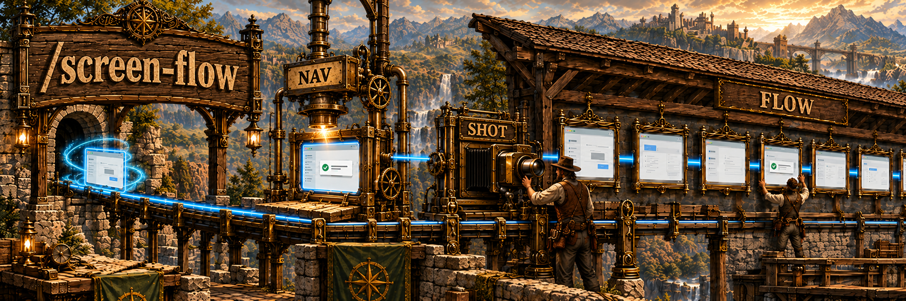
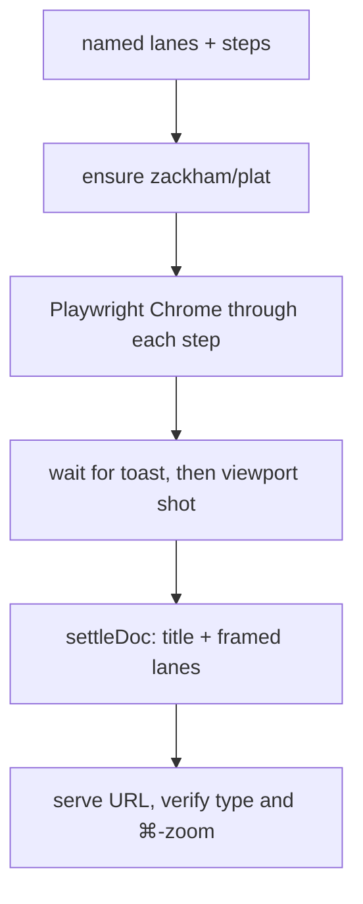

## Overview

A flow explanation that *describes* screens is easy to misread. `/screen-flow` films the real product: it drives a browser through the clicks, waits for the toast, and lays the shots onto a plat canvas in titled, bounded lanes.

Type on the board is screen-sized (title 36, captions 22). Zoom is ⌘/Ctrl + scroll, the same as plat itself. Schematics are a bug, not a fallback.

| The usual way | `/screen-flow` |
| --- | --- |
| Boxes and arrows that *look like* the app | Viewport screenshots of the app |
| 11px captions you cannot read at arm's length | Title 36 / captions 22 |
| Custom HTML that forgets zoom | plat: ⌘/Ctrl + wheel zooms toward the cursor |
| One undifferentiated strip | One framed lane per variant (before/after, happy/fail) |

### A pass



## Prerequisites

[Claude Code](https://docs.anthropic.com/en/docs/claude-code) (or another agent that can drive a browser and write files). Also:

- Node + npm (Vite host)
- Playwright / Google Chrome
- Network enough to `git clone https://github.com/zackham/plat` if it is not already on disk

A running app URL, or a conversation that already has the screenshots.

## Install

```bash
gh repo clone rickgorman/agent-files
cp -R agent-files/skills/screen-flow ~/.claude/skills/screen-flow
# or into a project:  cp -R agent-files/skills/screen-flow .claude/skills/screen-flow
```

```
/screen-flow signup → login verify → personal info
/screen-flow --url http://127.0.0.1:5174 --viewport mobile
/screen-flow                    # film the flow already in this conversation
```

## When to use

When someone needs to *see* a multi-screen journey: onboarding, checkout, a bug that only appears on the recovery path, a before/after of a fix. Not for architecture diagrams with no UI, and not for a single static screenshot.

## Output

- A local plat URL
- Titled lanes of real screenshots, toasts intact
- Captions at 22px, board title at 36px
- ⌘/Ctrl + scroll zoom

It will not draw fake phones, shrink type to pack more steps, or commit the board into the product repo. The procedure the agent follows is in [SKILL.md](SKILL.md).
