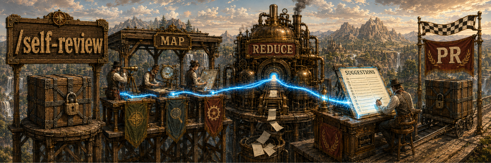
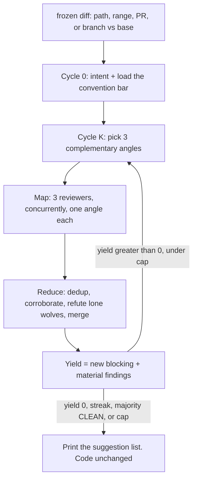

## Overview

A self-review from the same model that wrote the diff is just more of that model. `/self-review` freezes the code and map-reduces three fresh reviewers over it, cycle after cycle, until the suggestion list stops growing.

Each cycle maps three complementary angles onto the same diff, reduces their findings against everything already found, refute-checks lone wolves, and scores yield: how many new `blocking` or `material` findings actually landed. Nits don't count. It stops when yield is zero, when a majority of reviewers say `CLEAN` two cycles in a row, or at the cap (default 5).

The code never moves. The suggestion list is the artifact. A re-run on unchanged code reproduces the same list — that is correct, not failure.

| One more look from the author | `/self-review` |
| --- | --- |
| Same blind spots | Three angles, rotated each cycle |
| Findings die in chat | One ranked suggestion list |
| Open-ended polish | Stops when yield is 0 |
| The model also "fixes" it | Read-only. You decide what to apply |

### A cycle



## Prerequisites

[Claude Code](https://docs.anthropic.com/en/docs/claude-code), in a git repo. That's it. A PR target needs `gh`. Convention files (`CLAUDE.md`, `AGENTS.md`, `CONTRIBUTING.md`) are the review bar when they exist; otherwise it falls back to idiomatic norms for the stack and says so.

## Install

```bash
gh repo clone rickgorman/agent-files
cp -R agent-files/skills/self-review ~/.claude/skills/self-review
# or into a project:  cp -R agent-files/skills/self-review .claude/skills/self-review
```

```
/self-review                         # branch diff vs develop|main|master
/self-review path/to/dir             # only those files' diff
/self-review abc123..def456          # a commit range
/self-review 1387                    # gh pr diff
/self-review --max 3                 # cycle cap (default 5)
/self-review --out review.md         # also write the list
```

Empty diff? It says so and stops.

## When to use

After you think the change is done, before a human reviewer or a PR. You already have a diff. It won't write the fix, open the PR, or wander into unrelated files.

## Output

- A ranked suggestion list: blocking → material → minor → nit, each with file:line, consequence, and a suggested fix
- A report: cycles, yields (`3, 1, 0`), which angles ran, what a refute-check dismissed
- The tree, untouched

It will not invent churn to keep cycling, treat a style preference as blocking, or apply the fixes. The procedure the agent follows is in [SKILL.md](SKILL.md).
