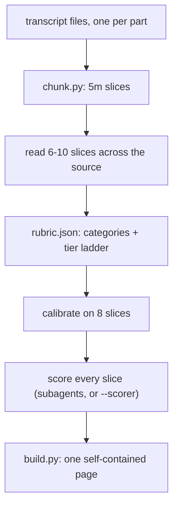

## Overview

A summary of a six-hour stream tells you what happened. It cannot tell you *where* anything was. `/transcript-heatmap` scores the recording five minutes at a time against a rubric written from the source itself, then draws the whole thing as sheet music: a bar is a few hours, a note is one slice, colour is the category, dot size is how deep that slice goes. Click a note and the transcript opens at that moment, with 500 words of context on either side.

The rubric is the work. Categories come from reading the source, tiers say what "deep" means for *this* recording, and a chunk nothing scored stays visibly unscored instead of getting a number to fill the grid.

| The usual way | `/transcript-heatmap` |
| --- | --- |
| One summary, flattening six hours to a page | Every five minutes placed on a timeline you can scan |
| "It gets good around the middle" | A dot at 3:25 on Day 2, sized by how good |
| Generic "insightful / not insightful" | 3–4 categories and a tier ladder in the source's own words |
| Quotes pulled out of their context | Click a note, read the chunk with the talk around it |
| Watch it again to check | `page.html`, and a sqlite of the scores if you want to query them |

### A pass



## Prerequisites

[Claude Code](https://docs.anthropic.com/en/docs/claude-code) (or another agent that can dispatch subagents and run scripts). Also:

- Python 3, standard library only
- A transcript: plain text, SRT, WebVTT, Whisper output, or a YouTube transcript dump. Timestamps are used when present and estimated from word count when not.

No API keys. Scoring runs on subagents by default; an external classifier is optional and plugs in through one shell command ([references/scorer.md](references/scorer.md)).

## Install

```bash
gh repo clone rickgorman/agent-files
cp -R agent-files/skills/transcript-heatmap ~/.claude/skills/transcript-heatmap
# or into a project:  cp -R agent-files/skills/transcript-heatmap .claude/skills/transcript-heatmap
```

```
/transcript-heatmap day1.txt day2.srt day3/ --label "Day 1" --label "Day 2" --label "Day 3"
/transcript-heatmap allhands.vtt --chunk 3m --bar 1h --out allhands.html
/transcript-heatmap                    # the transcript already in this conversation
```

## When to use

When a recording is too long to watch twice and someone has to find the parts worth watching once: a multi-day livestream, a conference track, a podcast back catalogue, a customer-call archive. Not for a 20-minute talk — read that. Not for finding one known quote — search for it.

## Output

- One self-contained HTML page: staves per part, a note per slice, category pills, a top-tier filter, per-part and whole-source copy buttons
- `chunks.jsonl`, `rubric.json`, `scores-*.jsonl` — the run, resumable and auditable
- Optional `--sqlite` dump of chunks and scores
- A census: scored/total, tier distribution per category, and anything that failed to score

It will not invent a score to fill a gap, reuse another recording's rubric, or paste the transcript into chat. The procedure the agent follows is in [SKILL.md](SKILL.md).
